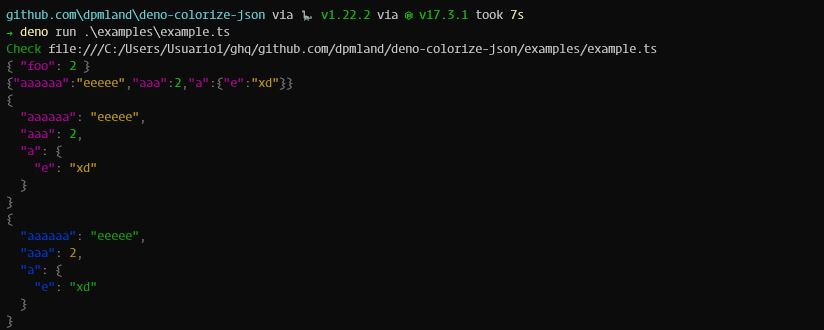

# deno-colorize-json

---



A library for colorizing JSON strings for DENO

> _Adapted from the Node Version
> [json-colorizer](https://github.com/joeattardi/json-colorizer)_

## Usage and Installation

### Installation

`dpm install json-colorize`

Or import like:

```ts
import { colorize } from 'https://deno.land/x/json_colorize/mod.ts';
```

### Usage

```ts
import { colorize } from 'https://deno.land/x/json_colorize/mod.ts';
colorize('{ \'foo\': \'bar\' }');
```

If you pass a string to the colorize function, it will treat it as
pre-serialized JSON. This can be used in order to colorize pretty-printed JSON:

```ts
import { colorize } from 'https://deno.land/x/json_colorize/mod.ts';
const json = JSON.stringify({ 'foo': 'bar' }, null, 2);
colorize(json);
```

And you can save the content in a variable and not print with this:

```ts
import { colorize } from 'https://deno.land/x/json_colorize/mod.ts';

const msg = colorize('{ \'fooo\': \'baaar\' }', { print: false });

console.log(`Save in a variable ${msg}`);
```

#### Customization colors

The tokens available are:

- `BRACE`
- `BRACKET`
- `COLON`
- `COMMA`
- `STRING_KEY`
- `STRING_LITERAL`
- `NUMBER_LITERAL`
- `BOOLEAN_LITERAL`
- `NULL_LITERAL`

You can custom like:

```ts
import {
  CODE_COLORS,
  colorize,
} from 'https://deno.land/x/json_colorize/mod.ts';

const example = {
  aaaaaa: 'eeeee',
  aaa: 2,
  a: {
    e: 'xd',
  },
};

colorize(JSON.stringify(example), {
  colors: {
    BRACE: CODE_COLORS.GRAY,
    BRACKET: CODE_COLORS.GRAY,
    COLON: CODE_COLORS.GRAY,
    COMMA: CODE_COLORS.GRAY,
    STRING_KEY: CODE_COLORS.BLUE,
    STRING_LITERAL: CODE_COLORS.GREEN,
    NUMBER_LITERAL: CODE_COLORS.YELLOW,
    BOOLEAN_LITERAL: CODE_COLORS.BLUE,
    NULL_LITERAL: CODE_COLORS.RED,
  },
});
```

## Information

- **Author:** Teo
- **Version:** 0.1.0
- **License:** GNU General Public License v3.0

---

Made by [dpm](https://github.com/dpmland/dpm)
